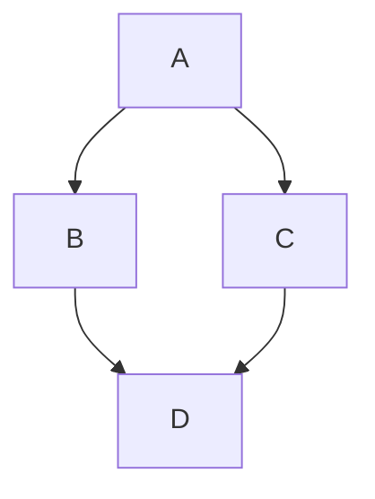
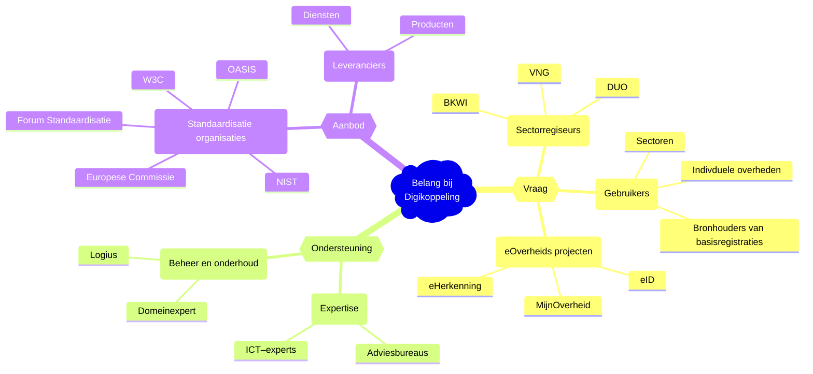

# Mermaid diagram

```mermaid
graph TD;
    A-->B;
    A-->C;
    B-->D;
    C-->D;
```
<figure>
<figcaption>Mermaid voorbeeld</figcaption>
</figure>

```mermaid
mindmap
  root)Belang bij<br>Digikoppeling(
    {{Vraag}}
      (Sectorregiseurs)
        VNG
        DUO
        BKWI
      (Gebruikers)
        Indivduele overheden
        Sectoren
        Bronhouders van basisregistraties
      (eOverheids projecten)
        MijnOverheid
        eHerkenning
        eID
    {{Ondersteuning}}
      (Expertise)
        Adviesbureaus
        ICT–experts
      (Beheer en onderhoud)
        Domeinexpert
        Logius
    {{Aanbod}}
      (Standaardisatie organisaties)
        OASIS
        W3C
        NIST
        Forum Standaardisatie
        Europese Commissie
      (Leveranciers)
        Diensten
        Producten
```
<figure>
<figcaption>Belang bij Digikoppeling</figcaption>
</figure>
